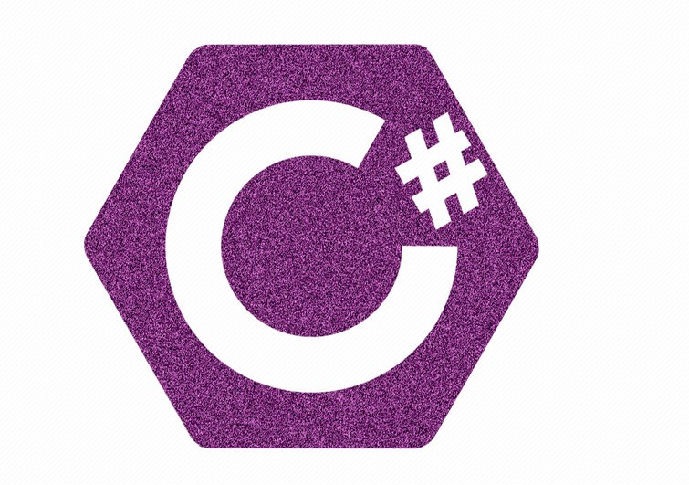

### ***
CSharp Homework
***

### 姓名：王康
### 学号：3021210011
### 指导老师：袁学民

###  **作业说明** 
###  **1.方向键操作** 

-[输入ASDW以控制光标的移动](https://gitee.com/wangkangtju/home-work2_-wang-kang/tree/master/%E7%A7%BB%E5%8A%A8%E5%85%89%E6%A0%87)
###  **2.日历表** 

-[输入任一年份，输出该年的日历表](https://gitee.com/wangkangtju/home-work2_-wang-kang/tree/master/%E6%97%A5%E5%8E%86%E8%A1%A8)
###  **3.输入游戏** 

-[输入↑↓←→以匹配随机生成的方向键，并记录用时与正确度](https://gitee.com/wangkangtju/home-work2_-wang-kang/tree/master/TabGame)
###  **4最大质数** 

-[输入一个正数，输出小于他的最大质数](https://gitee.com/wangkangtju/home-work2_-wang-kang/tree/master/%E6%9C%80%E5%A4%A7%E8%B4%A8%E6%95%B0)
###  **5.汉诺塔问题** 

-[模拟经典的“汉诺塔问题”](https://gitee.com/wangkangtju/home-work2_-wang-kang/tree/master/Hanoi%20Problem)

### **6.最小二乘法**
-[最小二乘法预计总GDP](https://gitee.com/wangkangtju/home-work2_-wang-kang/tree/master/%E6%9C%80%E5%B0%8F%E4%BA%8C%E4%B9%98%E6%B3%95)

### **7.维吉尼亚密码**
-[利用维吉尼亚密码加密字符](https://gitee.com/wangkangtju/home-work2_-wang-kang/tree/master/%E7%BB%B4%E5%90%89%E5%B0%BC%E4%BA%9A%E5%AF%86%E7%A0%81)

### **8.维吉尼亚密码_窗体版**
-[在窗体中输入字符，输出加密后结果](https://gitee.com/wangkangtju/home-work2_-wang-kang/tree/master/%E7%BB%B4%E5%90%89%E5%B0%BC%E4%BA%9A%E5%AF%86%E7%A0%81_%E7%AA%97%E4%BD%93%E7%89%88)# CSharp_Homework_21221
